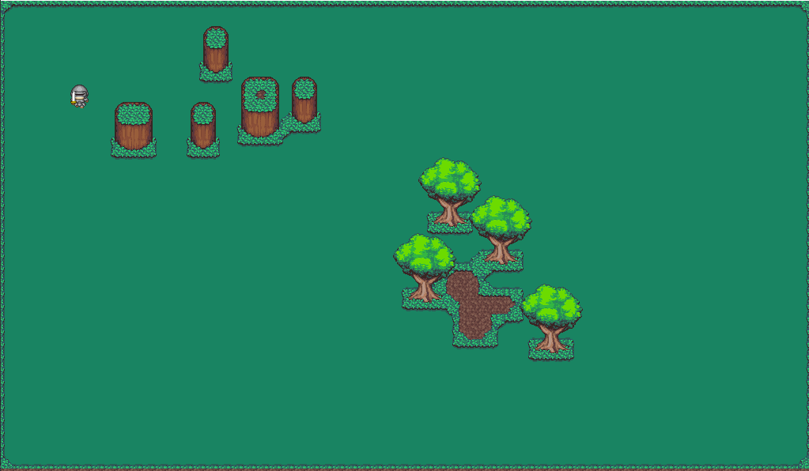

# NPC Move

Basic implementation of NPC movement in a overhead 2D zelda like. 

NPC has two modes of movement selectable in editor: 
* Random Movement with configurable x,y ranges
* Mouse follow movement

There is no pathfinding. The NPC will try to find the shortest path and slide around any objets in it's way if it can.

[Short video of this project in action.](https://www.youtube.com/watch?v=meWlQF8Csbg)

# Credits

Sprite sheets sourced from itch.io
* [PIPOYA FREE RPG Character Sprites 32x32 by pipoya](https://pipoya.itch.io/pipoya-free-rpg-character-sprites-32x32)
* [Jungle Tileset by finalbossblues](https://finalbossblues.itch.io/tf-jungle-tileset)
